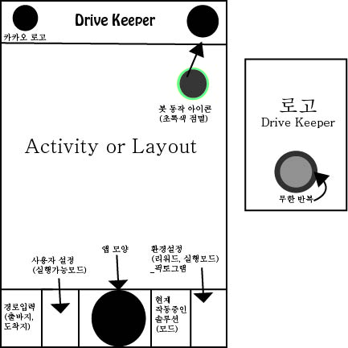

# Conference 18.06.27

## 회의 내용

#### 1차 멘토링 피드백\_6월 26일

* 멘토
  * 창업 위주의 피드백
  * 시리와 봇의 차이점
  * 구체화
  * 인터뷰 사례-&gt;멘토
  * 사용자 경험 추가 권유
  * 질문에 맞서 싸우지 말자
  * 경쟁 사례 차별화\(우리는 기존의 데이터 사용\)
* 강의
  * 데이터는 그냥 있으면 쓸모 없음
  * 대회주체측: 데이터를 사용해야 함
* 우리
  * 지금까지 그대로 계속 진

----------------------------------------------------------------------------------------------------

* 사람의 유형별로 발생한 사고를 통계적으로 접근해야 함\(발생빈도 등\)
* 정체완화\(속도 언급-&gt;차량 간격 일정\)
* 극단적으로 통계와 비교\(베트남 전쟁에서 나온 3천명의 사망자가 발하였는데 , 우리나라의 교통사고 사망자수는 5천명으로 전쟁 사망자수보다 훨씬 많음\)
* 사고는 나지 않도록 하는 것이 아니라 내지 않도록 하는 것임\(우리는 이런 솔루션이라는 것을 PPT에 보여야 함\)

#### UI 구상

### 

#### 기타 사항

* 음성인식-&gt; 분리

### To Do

* my safe driving\(사용\)\(api는 따로 발급받아야함\)_\(실시간은 api\)_ 
* 데이터가공스터디 
* R관련 및 통계적 접근 스터디
* _Xmind_ 데이터 매칭_\(솔루션-&gt;사이트-&gt;자료-&gt;열//데이터, API\)\__모두
* 로고_\__유진, 예영\(우리 맘대로\) 
* UI/UX 
* Kolnpy\_태정 
* 신청서부분에 창업\(앱\)으로 변경\_유진
* Activity, Indint, Service 이용해서 예제 만들어 코드 검사\_유진
* 자바스터디\_예영
* 동작 시나리오 구성

### 다음 회의 : 7월 3일 오후 6시 이후 \(김태정, 박유진, 김예영\)

